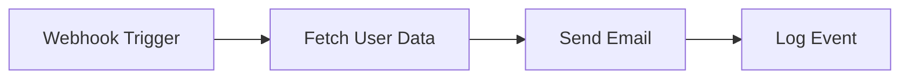
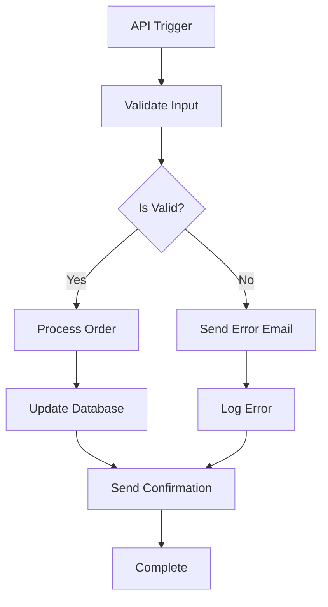
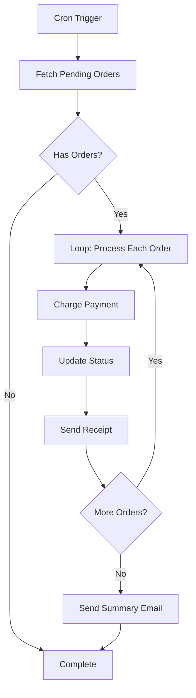
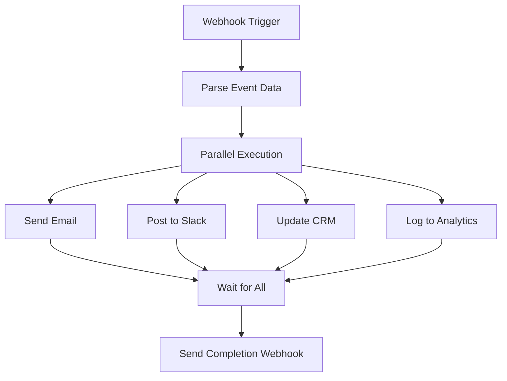
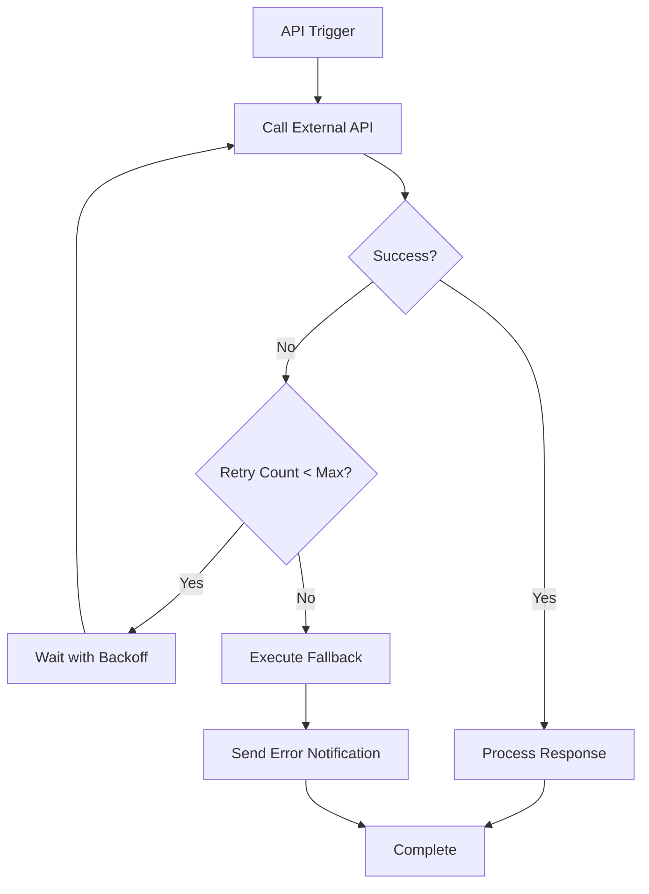

# Workflow Execution Flow Diagram

## Introduction

This document provides a comprehensive overview of the workflow execution lifecycle in the GoFlow Workflow Engine. It details all phases from initial trigger through completion, including state transitions, control flow logic, error handling, and recovery mechanisms.

### Execution Lifecycle Overview

A workflow execution progresses through five main phases:
1. **Trigger**: Initiation via API, webhook, or cron schedule
2. **Initialization**: Loading workflow definition and creating execution context
3. **Execution**: DAG traversal and node execution with worker pool
4. **Error Handling and Recovery**: Retry logic, circuit breakers, and checkpointing
5. **Completion**: Result aggregation, status updates, and cleanup

## Execution Phases

### Phase 1: Trigger

Workflows can be triggered through multiple mechanisms, each with specific authentication and validation requirements.

#### Trigger Mechanisms

**1. REST API Call**

```http
POST /api/v1/workflows/{workflow_id}/execute
Authorization: Bearer <jwt_token>
Content-Type: application/json

{
  "input": {
    "user_id": "123",
    "action": "process_order"
  },
  "variables": {
    "environment": "production"
  }
}
```

**Flow:**
1. HTTP request received by Gin router
2. Authentication middleware validates JWT token
3. Authorization middleware checks execute permission
4. Request body parsed and validated
5. ExecutionHandler delegates to ExecutionService

**2. HTTP Webhook**

```http
POST /webhooks/{webhook_path}
X-Webhook-Signature: sha256=<hmac_signature>
Content-Type: application/json

{
  "event": "user.created",
  "data": {
    "user_id": "123",
    "email": "user@example.com"
  }
}
```

**Flow:**
1. Webhook request received at configured path
2. HMAC signature validated using webhook secret
3. Webhook configuration loaded from database
4. Associated workflow identified
5. Execution triggered with webhook payload as input

**3. Cron Schedule**

**Flow:**
1. SchedulerService runs every minute (configurable)
2. Query `workflow_schedules` for enabled schedules where `next_run_at <= NOW()`
3. For each due schedule:
   - Load workflow definition
   - Create execution with configured input data
   - Update `last_run_at` and calculate `next_run_at`
   - Store `last_execution_id` reference

**4. Manual Trigger**

**Flow:**
1. User initiates execution via UI or CLI
2. Same authentication/authorization as REST API
3. Optional input data provided by user
4. Execution created and started immediately

#### Authentication and Authorization

**JWT Token Validation:**
```go
func (m *AuthMiddleware) ValidateToken(c *gin.Context) {
    token := extractToken(c.Request.Header.Get("Authorization"))

    claims, err := jwt.Parse(token, m.secretKey)
    if err != nil {
        c.AbortWithStatusJSON(401, gin.H{"error": "Invalid token"})
        return
    }

    c.Set("user_id", claims.UserID)
    c.Set("user_role", claims.Role)
    c.Next()
}
```

**RBAC Permission Check:**
```go
func (m *AuthMiddleware) RequirePermission(permission string) gin.HandlerFunc {
    return func(c *gin.Context) {
        role := c.GetString("user_role")

        if !hasPermission(role, permission) {
            c.AbortWithStatusJSON(403, gin.H{"error": "Insufficient permissions"})
            return
        }

        c.Next()
    }
}
```

#### Input Validation

**Validation Rules:**
- Input data must be valid JSON
- Required fields specified in workflow definition must be present
- Data types must match schema (if defined)
- Input size must not exceed 1MB (configurable)

**Example Validation:**
```go
func (s *ExecutionService) ValidateInput(workflow *Workflow, input map[string]interface{}) error {
    schema := workflow.InputSchema
    if schema == nil {
        return nil // No validation required
    }

    for field, rules := range schema.Required {
        if _, exists := input[field]; !exists {
            return fmt.Errorf("required field missing: %s", field)
        }
    }

    return nil
}
```

### Phase 2: Initialization

After successful trigger, the execution is initialized with all necessary context and validation.

#### Workflow Definition Loading

**Database Query:**
```sql
SELECT id, name, version, definition, status
FROM workflows
WHERE id = $1 AND deleted_at IS NULL;
```

**Validation:**
- Workflow must exist and not be soft-deleted
- Workflow status must be 'published'
- Workflow definition must be valid JSON

**Parsing:**
```go
type WorkflowDefinition struct {
    Nodes     []Node              `json:"nodes"`
    Edges     []Edge              `json:"edges"`
    Variables map[string]interface{} `json:"variables"`
    Secrets   map[string]string   `json:"secrets"`
}

func ParseDefinition(jsonb []byte) (*WorkflowDefinition, error) {
    var def WorkflowDefinition
    if err := json.Unmarshal(jsonb, &def); err != nil {
        return nil, fmt.Errorf("invalid workflow definition: %w", err)
    }
    return &def, nil
}
```

#### Execution Record Creation

**Database Insert:**
```sql
INSERT INTO workflow_executions (
    id, workflow_id, status, input_data, triggered_by, created_at
) VALUES (
    gen_random_uuid(), $1, 'pending', $2, $3, NOW()
) RETURNING id;
```

**Initial Status:** `pending`

**Execution Context:**
```go
type ExecutionContext struct {
    ExecutionID   string
    WorkflowID    string
    Definition    *WorkflowDefinition
    Input         map[string]interface{}
    Variables     map[string]interface{}
    Secrets       map[string]string
    NodeOutputs   map[string]map[string]interface{}
    StartTime     time.Time
    Metadata      map[string]interface{}
}
```

#### Input Data Validation

**Schema Validation:**
- Check required fields
- Validate data types
- Enforce size limits
- Sanitize input (prevent injection attacks)

**Variable Resolution:**
```go
func (ctx *ExecutionContext) ResolveVariables() {
    // Merge workflow variables with execution input
    ctx.Variables = mergeMaps(ctx.Definition.Variables, ctx.Input)

    // Decrypt secrets
    for key, encryptedValue := range ctx.Definition.Secrets {
        ctx.Secrets[key] = decrypt(encryptedValue)
    }
}
```

#### DAG Validation

**Cycle Detection:**
```go
func (v *DAGValidator) DetectCycles(nodes []Node, edges []Edge) error {
    graph := buildGraph(nodes, edges)
    visited := make(map[string]bool)
    recStack := make(map[string]bool)

    for _, node := range nodes {
        if hasCycle(node.ID, graph, visited, recStack) {
            return fmt.Errorf("cycle detected in workflow DAG")
        }
    }

    return nil
}

func hasCycle(nodeID string, graph map[string][]string, visited, recStack map[string]bool) bool {
    visited[nodeID] = true
    recStack[nodeID] = true

    for _, neighbor := range graph[nodeID] {
        if !visited[neighbor] {
            if hasCycle(neighbor, graph, visited, recStack) {
                return true
            }
        } else if recStack[neighbor] {
            return true
        }
    }

    recStack[nodeID] = false
    return false
}
```

**Edge Validation:**
- All edges must reference existing nodes
- No duplicate edges
- No self-referencing edges (except for loop nodes)

**Dependency Graph Construction:**
```go
type DependencyGraph struct {
    Nodes        map[string]*Node
    Dependencies map[string][]string  // node_id -> list of dependency node_ids
    Dependents   map[string][]string  // node_id -> list of dependent node_ids
}

func BuildDependencyGraph(nodes []Node, edges []Edge) *DependencyGraph {
    graph := &DependencyGraph{
        Nodes:        make(map[string]*Node),
        Dependencies: make(map[string][]string),
        Dependents:   make(map[string][]string),
    }

    for i := range nodes {
        graph.Nodes[nodes[i].ID] = &nodes[i]
    }

    for _, edge := range edges {
        graph.Dependencies[edge.To] = append(graph.Dependencies[edge.To], edge.From)
        graph.Dependents[edge.From] = append(graph.Dependents[edge.From], edge.To)
    }

    return graph
}
```

### Phase 3: Execution

The execution phase is where the actual workflow processing occurs, with nodes executed in topological order by a pool of worker goroutines.

#### Worker Pool Initialization

**Pool Configuration:**
```go
type WorkerPool struct {
    workerCount int
    jobQueue    chan *Job
    wg          sync.WaitGroup
    ctx         context.Context
    cancel      context.CancelFunc
}

func NewWorkerPool(workerCount, queueSize int) *WorkerPool {
    ctx, cancel := context.WithCancel(context.Background())

    pool := &WorkerPool{
        workerCount: workerCount,
        jobQueue:    make(chan *Job, queueSize),
        ctx:         ctx,
        cancel:      cancel,
    }

    return pool
}

func (p *WorkerPool) Start() {
    for i := 0; i < p.workerCount; i++ {
        p.wg.Add(1)
        go p.worker(i)
    }
}

func (p *WorkerPool) worker(id int) {
    defer p.wg.Done()

    for {
        select {
        case job := <-p.jobQueue:
            p.executeJob(job)
        case <-p.ctx.Done():
            return
        }
    }
}
```

**Environment Configuration:**
```bash
WORKER_POOL_SIZE=50      # Number of concurrent workers
QUEUE_SIZE=1000          # Job queue buffer size
```

#### DAG Traversal Algorithm

**Topological Sort (Kahn's Algorithm):**
```go
func (e *DAGExecutor) TopologicalSort(graph *DependencyGraph) ([]string, error) {
    inDegree := make(map[string]int)
    queue := []string{}
    result := []string{}

    // Calculate in-degree for each node
    for nodeID := range graph.Nodes {
        inDegree[nodeID] = len(graph.Dependencies[nodeID])
        if inDegree[nodeID] == 0 {
            queue = append(queue, nodeID)
        }
    }

    // Process nodes with zero in-degree
    for len(queue) > 0 {
        nodeID := queue[0]
        queue = queue[1:]
        result = append(result, nodeID)

        // Reduce in-degree for dependent nodes
        for _, dependent := range graph.Dependents[nodeID] {
            inDegree[dependent]--
            if inDegree[dependent] == 0 {
                queue = append(queue, dependent)
            }
        }
    }

    // Check if all nodes were processed (no cycles)
    if len(result) != len(graph.Nodes) {
        return nil, fmt.Errorf("cycle detected in DAG")
    }

    return result, nil
}
```

#### Node Execution Dispatch

**Job Submission:**
```go
type Job struct {
    NodeID      string
    Node        *Node
    Context     *ExecutionContext
    ResultChan  chan *JobResult
}

type JobResult struct {
    NodeID string
    Output map[string]interface{}
    Error  error
}

func (e *DAGExecutor) Execute(ctx *ExecutionContext) error {
    // Update status to running
    e.updateExecutionStatus(ctx.ExecutionID, "running")

    // Get execution order
    order, err := e.TopologicalSort(ctx.DependencyGraph)
    if err != nil {
        return err
    }

    // Track node completion
    completed := make(map[string]bool)
    resultChan := make(chan *JobResult, len(order))

    // Dispatch nodes when dependencies are satisfied
    for len(completed) < len(order) {
        for _, nodeID := range order {
            if completed[nodeID] {
                continue
            }

            // Check if all dependencies are completed
            if e.dependenciesSatisfied(nodeID, ctx.DependencyGraph, completed) {
                job := &Job{
                    NodeID:     nodeID,
                    Node:       ctx.DependencyGraph.Nodes[nodeID],
                    Context:    ctx,
                    ResultChan: resultChan,
                }

                e.workerPool.jobQueue <- job
            }
        }

        // Wait for node completion
        result := <-resultChan
        if result.Error != nil {
            return fmt.Errorf("node %s failed: %w", result.NodeID, result.Error)
        }

        // Store node output
        ctx.NodeOutputs[result.NodeID] = result.Output
        completed[result.NodeID] = true

        // Persist node execution result
        e.saveNodeExecution(ctx.ExecutionID, result)
    }

    return nil
}
```

#### Node-Specific Execution Logic

**1. Webhook Node:**
```go
func (e *WebhookExecutor) Execute(ctx context.Context, input map[string]interface{}) (map[string]interface{}, error) {
    // Webhook nodes receive data from external sources
    // The input contains the webhook payload
    return map[string]interface{}{
        "payload": input,
        "timestamp": time.Now().Unix(),
    }, nil
}
```

**2. HTTP Request Node:**
```go
func (e *HTTPRequestExecutor) Execute(ctx context.Context, input map[string]interface{}) (map[string]interface{}, error) {
    req, err := http.NewRequestWithContext(ctx, e.config.Method, e.config.URL, nil)
    if err != nil {
        return nil, err
    }

    // Add headers
    for key, value := range e.config.Headers {
        req.Header.Set(key, value)
    }

    // Execute request with timeout
    client := &http.Client{Timeout: e.config.Timeout}
    resp, err := client.Do(req)
    if err != nil {
        return nil, err
    }
    defer resp.Body.Close()

    body, _ := io.ReadAll(resp.Body)

    return map[string]interface{}{
        "status_code": resp.StatusCode,
        "headers":     resp.Header,
        "body":        string(body),
    }, nil
}
```

**3. Conditional Node:**
```go
func (e *ConditionalExecutor) Execute(ctx context.Context, input map[string]interface{}) (map[string]interface{}, error) {
    // Evaluate JavaScript expression
    vm := goja.New()
    vm.Set("input", input)
    vm.Set("nodes", e.context.NodeOutputs)

    result, err := vm.RunString(e.config.Condition)
    if err != nil {
        return nil, fmt.Errorf("condition evaluation failed: %w", err)
    }

    conditionMet := result.ToBoolean()

    return map[string]interface{}{
        "condition_met": conditionMet,
        "branch":        e.selectBranch(conditionMet),
    }, nil
}
```

**4. Loop Node:**
```go
func (e *LoopExecutor) Execute(ctx context.Context, input map[string]interface{}) (map[string]interface{}, error) {
    items, ok := input[e.config.ItemsField].([]interface{})
    if !ok {
        return nil, fmt.Errorf("items field not found or invalid type")
    }

    results := make([]map[string]interface{}, 0, len(items))

    if e.config.Parallel {
        // Parallel execution
        var wg sync.WaitGroup
        resultChan := make(chan map[string]interface{}, len(items))

        for _, item := range items {
            wg.Add(1)
            go func(item interface{}) {
                defer wg.Done()
                result := e.executeIteration(ctx, item)
                resultChan <- result
            }(item)
        }

        wg.Wait()
        close(resultChan)

        for result := range resultChan {
            results = append(results, result)
        }
    } else {
        // Sequential execution
        for _, item := range items {
            result := e.executeIteration(ctx, item)
            results = append(results, result)
        }
    }

    return map[string]interface{}{
        "results": results,
        "count":   len(results),
    }, nil
}
```

**5. Transform Node:**
```go
func (e *TransformExecutor) Execute(ctx context.Context, input map[string]interface{}) (map[string]interface{}, error) {
    vm := goja.New()
    vm.Set("input", input)
    vm.Set("nodes", e.context.NodeOutputs)

    // Execute transformation script with timeout
    done := make(chan struct{})
    var result goja.Value
    var err error

    go func() {
        result, err = vm.RunString(e.config.Script)
        close(done)
    }()

    select {
    case <-done:
        if err != nil {
            return nil, err
        }
        return result.Export().(map[string]interface{}), nil
    case <-time.After(e.config.Timeout):
        return nil, fmt.Errorf("transformation timeout exceeded")
    }
}
```

**6. Database Node:**
```go
func (e *DatabaseExecutor) Execute(ctx context.Context, input map[string]interface{}) (map[string]interface{}, error) {
    // Prepare parameterized query
    stmt, err := e.db.PrepareContext(ctx, e.config.Query)
    if err != nil {
        return nil, err
    }
    defer stmt.Close()

    // Execute query
    rows, err := stmt.QueryContext(ctx, e.config.Params...)
    if err != nil {
        return nil, err
    }
    defer rows.Close()

    // Scan results
    results := []map[string]interface{}{}
    for rows.Next() {
        row := make(map[string]interface{})
        // Scan row into map
        results = append(results, row)
    }

    return map[string]interface{}{
        "rows":          results,
        "rows_affected": len(results),
    }, nil
}
```

#### State Updates and Telemetry

**Node Execution Persistence:**
```sql
INSERT INTO node_executions (
    id, execution_id, node_id, node_type, status,
    input_data, output_data, started_at, completed_at
) VALUES (
    gen_random_uuid(), $1, $2, $3, $4, $5, $6, $7, $8
);
```

**Telemetry Events:**
```go
func (e *DAGExecutor) emitNodeExecutionEvent(nodeID string, status string, duration time.Duration) {
    // Prometheus metrics
    nodeExecutionsTotal.WithLabelValues(nodeType, status).Inc()
    nodeExecutionDuration.WithLabelValues(nodeType).Observe(duration.Seconds())

    // OpenTelemetry span
    span := trace.SpanFromContext(ctx)
    span.SetAttributes(
        attribute.String("node.id", nodeID),
        attribute.String("node.type", nodeType),
        attribute.String("node.status", status),
    )

    // Structured log
    logger.Info("Node executed",
        zap.String("node_id", nodeID),
        zap.String("status", status),
        zap.Duration("duration", duration),
    )
}
```

### Phase 4: Error Handling and Recovery

Robust error handling ensures workflow reliability and recoverability.

#### Retry Policies

**Exponential Backoff:**
```go
type RetryPolicy struct {
    MaxAttempts     int
    InitialDelay    time.Duration
    MaxDelay        time.Duration
    BackoffFactor   float64
}

func (p *RetryPolicy) Execute(fn func() error) error {
    var err error
    delay := p.InitialDelay

    for attempt := 1; attempt <= p.MaxAttempts; attempt++ {
        err = fn()
        if err == nil {
            return nil
        }

        if attempt < p.MaxAttempts {
            time.Sleep(delay)
            delay = time.Duration(float64(delay) * p.BackoffFactor)
            if delay > p.MaxDelay {
                delay = p.MaxDelay
            }
        }
    }

    return fmt.Errorf("max retry attempts exceeded: %w", err)
}
```

**Configuration:**
```go
retryPolicy := &RetryPolicy{
    MaxAttempts:   5,
    InitialDelay:  1 * time.Second,
    MaxDelay:      32 * time.Second,
    BackoffFactor: 2.0,
}
```

**Retry Sequence:** 1s → 2s → 4s → 8s → 16s → 32s

#### Circuit Breaker Pattern

**Implementation:**
```go
type CircuitBreaker struct {
    maxFailures     int
    resetTimeout    time.Duration
    state           string  // "closed", "open", "half-open"
    failures        int
    lastFailureTime time.Time
    mu              sync.Mutex
}

func (cb *CircuitBreaker) Execute(fn func() error) error {
    cb.mu.Lock()

    // Check if circuit should reset
    if cb.state == "open" && time.Since(cb.lastFailureTime) > cb.resetTimeout {
        cb.state = "half-open"
        cb.failures = 0
    }

    // Reject if circuit is open
    if cb.state == "open" {
        cb.mu.Unlock()
        return fmt.Errorf("circuit breaker is open")
    }

    cb.mu.Unlock()

    // Execute function
    err := fn()

    cb.mu.Lock()
    defer cb.mu.Unlock()

    if err != nil {
        cb.failures++
        cb.lastFailureTime = time.Now()

        if cb.failures >= cb.maxFailures {
            cb.state = "open"
        }

        return err
    }

    // Success - reset circuit
    cb.failures = 0
    cb.state = "closed"
    return nil
}
```

#### Checkpointing

**Periodic State Snapshots:**
```go
func (e *DAGExecutor) checkpoint(ctx *ExecutionContext) error {
    checkpoint := &Checkpoint{
        ExecutionID:  ctx.ExecutionID,
        NodeOutputs:  ctx.NodeOutputs,
        CompletedNodes: ctx.CompletedNodes,
        Timestamp:    time.Now(),
    }

    // Persist to database
    return e.repo.SaveCheckpoint(checkpoint)
}

// Checkpoint every 10 seconds or after each node
func (e *DAGExecutor) Execute(ctx *ExecutionContext) error {
    ticker := time.NewTicker(10 * time.Second)
    defer ticker.Stop()

    go func() {
        for range ticker.C {
            e.checkpoint(ctx)
        }
    }()

    // Execute workflow...
}
```

#### Inngest Durability

**Durable Function Registration:**
```go
inngest.CreateFunction(
    inngest.FunctionOpts{
        Name:    "execute-workflow",
        Retries: 5,
    },
    inngest.EventTrigger("workflow/execute", nil),
    func(ctx context.Context, input inngest.Input[WorkflowEvent]) (interface{}, error) {
        // Load checkpoint if exists
        checkpoint, err := loadCheckpoint(input.Event.Data.ExecutionID)
        if err == nil && checkpoint != nil {
            // Resume from checkpoint
            return resumeExecution(ctx, checkpoint)
        }

        // Start new execution
        return executeWorkflow(ctx, input.Event.Data)
    },
)
```

**Automatic Resumption:**
- Process crashes are detected by Inngest
- Workflow resumes from last checkpoint
- No duplicate node executions
- State consistency maintained

#### Error Propagation

**Error Types:**
```go
type NodeError struct {
    NodeID    string
    NodeType  string
    Message   string
    Retryable bool
}

type WorkflowError struct {
    ExecutionID string
    FailedNode  *NodeError
    Cause       error
}
```

**Fallback Logic:**
```go
func (e *DAGExecutor) executeNode(node *Node, ctx *ExecutionContext) error {
    err := e.executeWithRetry(node, ctx)
    if err != nil {
        // Check if fallback node is configured
        if node.Config.FallbackNodeID != "" {
            fallbackNode := ctx.DependencyGraph.Nodes[node.Config.FallbackNodeID]
            return e.executeNode(fallbackNode, ctx)
        }

        return err
    }

    return nil
}
```

### Phase 5: Completion

Final phase aggregates results, updates status, and performs cleanup.

#### Result Aggregation

**Collect Terminal Node Outputs:**
```go
func (e *DAGExecutor) aggregateResults(ctx *ExecutionContext) map[string]interface{} {
    results := make(map[string]interface{})

    // Find terminal nodes (nodes with no dependents)
    for nodeID, node := range ctx.DependencyGraph.Nodes {
        if len(ctx.DependencyGraph.Dependents[nodeID]) == 0 {
            results[nodeID] = ctx.NodeOutputs[nodeID]
        }
    }

    return results
}
```

#### Status Updates

**Update Execution Record:**
```sql
UPDATE workflow_executions
SET status = $1,
    output_data = $2,
    completed_at = NOW()
WHERE id = $3;
```

**Final Status Determination:**
```go
func (e *DAGExecutor) determineStatus(ctx *ExecutionContext) string {
    for _, nodeExecution := range ctx.NodeExecutions {
        if nodeExecution.Status == "failed" {
            return "failed"
        }
        if nodeExecution.Status == "cancelled" {
            return "cancelled"
        }
    }

    return "completed"
}
```

#### Completion Webhooks

**Trigger Configured Webhooks:**
```go
func (e *DAGExecutor) triggerCompletionWebhooks(ctx *ExecutionContext, status string) error {
    webhooks := e.getCompletionWebhooks(ctx.WorkflowID)

    payload := map[string]interface{}{
        "execution_id": ctx.ExecutionID,
        "workflow_id":  ctx.WorkflowID,
        "status":       status,
        "output":       ctx.Output,
        "started_at":   ctx.StartTime,
        "completed_at": time.Now(),
    }

    for _, webhook := range webhooks {
        go e.sendWebhook(webhook, payload)
    }

    return nil
}

func (e *DAGExecutor) sendWebhook(webhook *Webhook, payload map[string]interface{}) error {
    body, _ := json.Marshal(payload)

    req, _ := http.NewRequest("POST", webhook.URL, bytes.NewBuffer(body))
    req.Header.Set("Content-Type", "application/json")

    // Add HMAC signature
    signature := generateHMAC(body, webhook.Secret)
    req.Header.Set("X-Webhook-Signature", signature)

    client := &http.Client{Timeout: 10 * time.Second}
    resp, err := client.Do(req)
    if err != nil {
        // Retry webhook delivery
        return e.retryWebhook(webhook, payload)
    }
    defer resp.Body.Close()

    return nil
}
```

#### Cleanup

**Resource Cleanup:**
```go
func (e *DAGExecutor) cleanup(ctx *ExecutionContext) {
    // Release distributed locks
    if ctx.Lock != nil {
        ctx.Lock.Release()
    }

    // Clear in-memory execution context
    ctx.NodeOutputs = nil
    ctx.Variables = nil
    ctx.Secrets = nil

    // Close database transactions
    if ctx.Tx != nil {
        ctx.Tx.Commit()
    }

    // Shutdown worker pool gracefully
    e.workerPool.Shutdown()
}

func (p *WorkerPool) Shutdown() {
    p.cancel()

    // Wait for all workers to finish
    p.wg.Wait()

    // Close job queue
    close(p.jobQueue)
}
```

## State Machine

### State Transition Table

| Current State | Event | Next State | Description | Actions |
|---------------|-------|------------|-------------|---------|
| `pending` | Execution started | `running` | Worker pool begins processing | Create execution context, initialize workers |
| `running` | All nodes completed successfully | `completed` | Workflow finished successfully | Aggregate results, trigger webhooks |
| `running` | Node failure (retries exhausted) | `failed` | Unrecoverable error occurred | Log error, save error message, trigger error webhooks |
| `running` | Manual cancellation | `cancelled` | User or system stopped execution | Stop workers, cleanup resources |
| `running` | Timeout exceeded | `timeout` | Execution exceeded max duration | Force stop, save partial results |
| `running` | System restart | `running` | Inngest resumes from checkpoint | Load checkpoint, resume execution |
| `failed` | Manual retry | `running` | Execution restarted | Reset state, restart from beginning or checkpoint |
| `completed` | - | - | Terminal state | No further transitions |
| `cancelled` | - | - | Terminal state | No further transitions |
| `timeout` | Manual retry | `running` | Retry with extended timeout | Increase timeout, restart execution |

### State Diagram

```
                    ┌─────────┐
                    │ pending │
                    └────┬────┘
                         │ start
                         ▼
    ┌────────────────────────────────────┐
    │           running                  │◄──── resume (system restart)
    └────┬───────┬───────┬───────┬──────┘
         │       │       │       │
         │       │       │       └─────► timeout ──────┐
         │       │       │                              │
         │       │       └─────► cancelled ─────────────┤
         │       │                                      │
         │       └─────► failed ────────────────────────┤
         │                                              │
         └─────► completed ◄────────────────────────────┘
                 (terminal states)
```

### State Persistence

**Database Updates:**
```go
func (r *ExecutionRepository) UpdateStatus(executionID string, status string) error {
    query := `
        UPDATE workflow_executions
        SET status = $1, updated_at = NOW()
        WHERE id = $2
    `
    _, err := r.db.Exec(query, status, executionID)
    return err
}
```

**State Validation:**
```go
func (s *ExecutionService) ValidateStateTransition(current, next string) error {
    validTransitions := map[string][]string{
        "pending":   {"running", "cancelled"},
        "running":   {"completed", "failed", "cancelled", "timeout"},
        "failed":    {"running"},  // Allow retry
        "timeout":   {"running"},  // Allow retry
        "completed": {},           // Terminal
        "cancelled": {},           // Terminal
    }

    allowed := validTransitions[current]
    for _, state := range allowed {
        if state == next {
            return nil
        }
    }

    return fmt.Errorf("invalid state transition: %s -> %s", current, next)
}
```

## Concurrency and Parallelism

### Goroutine-Based Worker Pool Architecture

**Worker Pool Design:**
```
                    ┌──────────────┐
                    │  Job Queue   │
                    │  (buffered)  │
                    └──────┬───────┘
                           │
         ┌─────────────────┼─────────────────┐
         │                 │                 │
         ▼                 ▼                 ▼
    ┌────────┐        ┌────────┐       ┌────────┐
    │Worker 1│        │Worker 2│  ...  │Worker N│
    └────────┘        └────────┘       └────────┘
         │                 │                 │
         └─────────────────┼─────────────────┘
                           │
                           ▼
                   ┌───────────────┐
                   │ Result Channel│
                   └───────────────┘
```

### Channel-Based Job Queue

**Job Submission:**
```go
type Job struct {
    ID         string
    NodeID     string
    Executor   NodeExecutor
    Input      map[string]interface{}
    ResultChan chan<- *JobResult
}

func (p *WorkerPool) Submit(job *Job) error {
    select {
    case p.jobQueue <- job:
        return nil
    case <-time.After(5 * time.Second):
        return fmt.Errorf("job queue full, timeout exceeded")
    }
}
```

### Configurable Worker Count and Queue Size

**Environment Variables:**
```bash
WORKER_POOL_SIZE=50      # Concurrent workers
QUEUE_SIZE=1000          # Buffered job queue
MAX_QUEUE_WAIT=5s        # Max wait time for queue space
```

**Dynamic Scaling:**
```go
func (p *WorkerPool) Scale(newWorkerCount int) {
    if newWorkerCount > p.workerCount {
        // Add workers
        for i := p.workerCount; i < newWorkerCount; i++ {
            p.wg.Add(1)
            go p.worker(i)
        }
    } else if newWorkerCount < p.workerCount {
        // Remove workers (gracefully)
        for i := newWorkerCount; i < p.workerCount; i++ {
            p.stopWorker(i)
        }
    }

    p.workerCount = newWorkerCount
}
```

### Parallel Node Execution

**Independent Branches:**
```go
func (e *DAGExecutor) executeParallelBranches(branches [][]string, ctx *ExecutionContext) error {
    var wg sync.WaitGroup
    errChan := make(chan error, len(branches))

    for _, branch := range branches {
        wg.Add(1)
        go func(nodes []string) {
            defer wg.Done()

            for _, nodeID := range nodes {
                if err := e.executeNode(nodeID, ctx); err != nil {
                    errChan <- err
                    return
                }
            }
        }(branch)
    }

    wg.Wait()
    close(errChan)

    // Check for errors
    for err := range errChan {
        if err != nil {
            return err
        }
    }

    return nil
}
```

### Synchronization Mechanisms

**WaitGroups:**
```go
var wg sync.WaitGroup

for _, node := range parallelNodes {
    wg.Add(1)
    go func(n *Node) {
        defer wg.Done()
        executeNode(n)
    }(node)
}

wg.Wait()  // Wait for all parallel nodes to complete
```

**Mutexes:**
```go
type ExecutionContext struct {
    NodeOutputs map[string]map[string]interface{}
    mu          sync.RWMutex
}

func (ctx *ExecutionContext) SetNodeOutput(nodeID string, output map[string]interface{}) {
    ctx.mu.Lock()
    defer ctx.mu.Unlock()
    ctx.NodeOutputs[nodeID] = output
}

func (ctx *ExecutionContext) GetNodeOutput(nodeID string) map[string]interface{} {
    ctx.mu.RLock()
    defer ctx.mu.RUnlock()
    return ctx.NodeOutputs[nodeID]
}
```

**Channels for Coordination:**
```go
type Coordinator struct {
    nodeDone chan string
    allDone  chan struct{}
}

func (c *Coordinator) WaitForNode(nodeID string) {
    <-c.nodeDone
}

func (c *Coordinator) NotifyNodeComplete(nodeID string) {
    c.nodeDone <- nodeID
}
```

## Control Flow Examples

### Example 1: Simple Linear Workflow



**Execution Flow:**
1. Webhook receives user signup event
2. HTTP request fetches user details from API
3. Email sent to user with welcome message
4. Event logged to database

**Execution Time:** Sequential, ~2-3 seconds total

### Example 2: Conditional Branching Workflow



**Execution Flow:**
1. API receives order request
2. Input validation checks required fields
3. Conditional node evaluates validation result
4. **If valid:** Process order → Update database → Send confirmation
5. **If invalid:** Send error email → Log error
6. Both paths converge at completion

**Key Feature:** Conditional branching based on runtime data

### Example 3: Loop-Based Workflow



**Execution Flow:**
1. Cron triggers daily at midnight
2. Fetch all pending orders from database
3. Loop through each order:
   - Charge payment via Stripe API
   - Update order status in database
   - Send receipt email to customer
4. After all orders processed, send summary email to admin

**Key Feature:** Iteration over collection with sequential or parallel execution

### Example 4: Parallel Execution Workflow



**Execution Flow:**
1. Webhook receives new lead event
2. Parse event data and extract fields
3. Execute four independent tasks in parallel:
   - Send welcome email
   - Post notification to Slack
   - Update CRM system
   - Log event to analytics platform
4. Wait for all parallel tasks to complete
5. Send completion webhook to external system

**Key Feature:** Concurrent execution of independent branches

**Performance:** 4x faster than sequential execution

### Example 5: Error Handling and Retry Flow



**Execution Flow:**
1. API call to external service
2. Check if call succeeded
3. **If success:** Process response and complete
4. **If failure:** Check retry count
   - If retries remaining: Wait (exponential backoff) and retry
   - If max retries exceeded: Execute fallback logic
5. Fallback sends error notification to admin
6. Workflow completes (with partial success)

**Key Feature:** Automatic retry with exponential backoff and fallback handling

## Observability and Monitoring

### Metrics Emitted During Execution

**Workflow-Level Metrics:**
```go
workflowExecutionsTotal.WithLabelValues(workflowID, status).Inc()
workflowExecutionDuration.WithLabelValues(workflowID).Observe(duration.Seconds())
workflowActiveExecutions.WithLabelValues(workflowID).Set(float64(activeCount))
```

**Node-Level Metrics:**
```go
nodeExecutionsTotal.WithLabelValues(nodeType, status).Inc()
nodeExecutionDuration.WithLabelValues(nodeType).Observe(duration.Seconds())
nodeRetries.WithLabelValues(nodeType).Add(float64(retryCount))
```

**System-Level Metrics:**
```go
workerPoolActiveWorkers.Set(float64(activeWorkers))
workerPoolQueueSize.Set(float64(queueSize))
workerPoolQueueWaitDuration.Observe(waitDuration.Seconds())
```

### Trace Spans for Distributed Tracing

**Span Hierarchy:**
```
workflow_execution (root span)
├── load_workflow_definition
├── validate_dag
├── initialize_worker_pool
├── node_execution: webhook_trigger
├── node_execution: fetch_data
│   └── http_request
├── node_execution: transform_data
│   └── javascript_evaluation
└── aggregate_results
```

**Span Creation:**
```go
func (e *DAGExecutor) executeNode(ctx context.Context, node *Node) error {
    ctx, span := tracer.Start(ctx, "node_execution",
        trace.WithAttributes(
            attribute.String("node.id", node.ID),
            attribute.String("node.type", node.Type),
        ),
    )
    defer span.End()

    // Execute node...

    span.SetAttributes(
        attribute.String("node.status", "completed"),
        attribute.Int64("node.duration_ms", duration.Milliseconds()),
    )

    return nil
}
```

### Log Levels and Structured Logging

**Log Levels:**
- `DEBUG`: Node input/output data, detailed execution steps
- `INFO`: Workflow started, node completed, workflow completed
- `WARN`: Retry attempts, slow node execution, high queue size
- `ERROR`: Node failures, workflow failures, system errors

**Structured Log Example:**
```json
{
  "level": "info",
  "timestamp": "2024-01-01T10:00:00Z",
  "message": "Node executed successfully",
  "execution_id": "exec_123",
  "workflow_id": "wf_456",
  "node_id": "fetch_data",
  "node_type": "http_request",
  "duration_ms": 234,
  "retry_count": 0,
  "trace_id": "abc123",
  "span_id": "def456"
}
```

### Performance Monitoring Points

**Critical Path Monitoring:**
1. **Workflow Load Time**: Time to fetch and parse workflow definition
2. **DAG Validation Time**: Time to validate and build dependency graph
3. **Node Execution Time**: Per-node execution duration
4. **Queue Wait Time**: Time job spends in queue before execution
5. **Total Execution Time**: End-to-end workflow duration

**Alerting Thresholds:**
- Workflow execution > 5 minutes: Warning
- Workflow execution > 15 minutes: Critical
- Node failure rate > 5%: Warning
- Worker pool queue > 80% full: Warning
- Database query > 1 second: Warning

## Diagram Reference

For a visual representation of the workflow execution flow, see [flow-diagram.png](./flow-diagram.png).

The flow diagram illustrates:
- Complete execution lifecycle from trigger to completion
- State transitions and decision points
- Error handling and retry logic
- Parallel execution paths
- Checkpointing and recovery mechanisms

---

**Related Documentation:**
- [System Overview](./system-overview.md)
- [Database Schema](./database-schema.md)
- [Architecture Overview](../architecture.md)
- [Node Types Documentation](../guides/node-types.md)
- [Troubleshooting Guide](../guides/troubleshooting.md)
