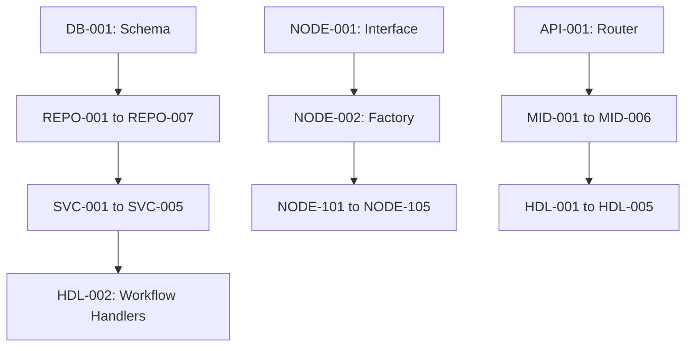

# GoFlow Implementation Quick Reference

## 📋 Current Sprint Focus

**Sprint**: 1 (Weeks 1-2)  
**Goal**: Foundation & Core Infrastructure  
**Target**: Complete Phase 1 & 2 (33 tasks)

---

## 🎯 Today's Priority Tasks

### P0 - Critical (Must Complete Today)

| Task ID | Component | Status | Assignee | Notes |
|---------|-----------|--------|----------|-------|
| DB-001 | Schema Setup | ⭕ | - | Create all 7 database tables |
| DB-002 | Migrations | ⭕ | - | Setup golang-migrate |
| CFG-001 | Viper Setup | ⭕ | - | Configure multi-source config |

---

## 📊 Sprint Progress Dashboard

### Phase 1: Foundation & Core Infrastructure

```
Progress: [░░░░░░░░░░░░░░░░░░░░] 0/21 (0%)

Database Layer:        [░░░░░] 0/5
Repository Layer:      [░░░░░░░░] 0/8
Configuration:         [░░░░] 0/4
Logging:               [░░░░] 0/4
```

### Phase 2: Core Domain Logic

```
Progress: [░░░░░░░░░░░░░░░░░░░░] 0/12 (0%)

Domain Models:         [░░░░░░░] 0/7
Validation:            [░░░░░] 0/5
```

---

## ✅ Recently Completed

| Task ID | Component | Completed By | Date |
|---------|-----------|--------------|------|
| INIT-002 | Project Structure | AI Assistant | 2025-10-23 |
| INIT-001 | Go Module Setup | AI Assistant | 2025-10-23 |

---

## 🔥 Blockers & Issues

| Issue | Impact | Blocked Tasks | Resolution |
|-------|--------|---------------|------------|
| None currently | - | - | - |

---


---

## 📅 Upcoming Milestones

| Milestone | Target Date | Status | Tasks Remaining |
|-----------|-------------|--------|-----------------|
| Phase 1 Complete | Week 2 | ⭕ | 21 |
| Phase 2 Complete | Week 4 | ⭕ | 12 |
| MVP (P0 Complete) | Week 16 | ⭕ | 121 |
| Production Ready | Week 24 | ⭕ | 197 |

---

## 🚀 Quick Task Lookup

### By Component

#### Database (13 tasks)
- **Schema**: DB-001 to DB-005 (5 tasks)
- **Repositories**: REPO-001 to REPO-008 (8 tasks)

#### Domain (12 tasks)
- **Models**: DOM-001 to DOM-007 (7 tasks)
- **Validation**: VAL-001 to VAL-005 (5 tasks)

#### Engine (18 tasks)
- **DAG**: DAG-001 to DAG-004 (4 tasks)
- **Context**: CTX-001 to CTX-004 (4 tasks)
- **Expressions**: EXPR-001 to EXPR-005 (5 tasks)
- **Workers**: WORK-001 to WORK-005 (5 tasks)

#### Nodes (15 tasks)
- **Framework**: NODE-001 to NODE-004 (4 tasks)
- **Core**: NODE-101 to NODE-105 (5 tasks)
- **Advanced**: NODE-201 to NODE-204 (4 tasks)
- **AI**: NODE-301 to NODE-302 (2 tasks)

#### Services (20 tasks)
- **Workflow**: SVC-001 to SVC-005 (5 tasks)
- **Execution**: SVC-101 to SVC-105 (5 tasks)
- **Schedule**: SVC-201 to SVC-205 (5 tasks)
- **Webhook**: SVC-301 to SVC-305 (5 tasks)

#### API (21 tasks)
- **Infrastructure**: API-001 to API-005 (5 tasks)
- **Middleware**: MID-001 to MID-006 (6 tasks)
- **Handlers**: HDL-001 to HDL-005 (5 tasks)
- **Auth**: AUTH-001 to AUTH-006 (6 tasks)
- **Authz**: AUTHZ-001 to AUTHZ-004 (4 tasks)

---

## 📈 Coverage Metrics

### Overall Progress
```
Total Tasks:     238
Completed:       0 (0%)
In Progress:     0 (0%)
Not Started:     238 (100%)
```

### By Priority
```
P0 (Critical):   121 tasks → 0 complete (0%)
P1 (High):       76 tasks  → 0 complete (0%)
P2 (Medium):     33 tasks  → 0 complete (0%)
P3 (Low):        8 tasks   → 0 complete (0%)
```

### By Phase
```
Phase 1:  0/21   (0%)  ░░░░░░░░░░░░░░░░░░░░
Phase 2:  0/12   (0%)  ░░░░░░░░░░░░░░░░░░░░
Phase 3:  0/18   (0%)  ░░░░░░░░░░░░░░░░░░░░
Phase 4:  0/15   (0%)  ░░░░░░░░░░░░░░░░░░░░
Phase 5:  0/20   (0%)  ░░░░░░░░░░░░░░░░░░░░
Phase 6:  0/16   (0%)  ░░░░░░░░░░░░░░░░░░░░
Phase 7:  0/10   (0%)  ░░░░░░░░░░░░░░░░░░░░
Phase 8:  0/19   (0%)  ░░░░░░░░░░░░░░░░░░░░
Phase 9:  0/15   (0%)  ░░░░░░░░░░░░░░░░░░░░
Phase 10: 0/15   (0%)  ░░░░░░░░░░░░░░░░░░░░
Phase 11: 0/21   (0%)  ░░░░░░░░░░░░░░░░░░░░
Phase 12: 0/22   (0%)  ░░░░░░░░░░░░░░░░░░░░
Phase 13: 0/10   (0%)  ░░░░░░░░░░░░░░░░░░░░
Phase 14: 0/12   (0%)  ░░░░░░░░░░░░░░░░░░░░
Phase 15: 0/12   (0%)  ░░░░░░░░░░░░░░░░░░░░
```

---

## 🔗 Critical Dependencies

### Must Complete Before Starting Other Work



---

## 💡 Quick Commands

### Development
```bash
# Run tests
make test

# Run specific test
go test ./internal/service -run TestWorkflowService

# Check coverage
make test-coverage

# Run linter
make lint

# Start dev server
make dev
```

### Database
```bash
# Run migrations
make migrate-up

# Rollback migration
make migrate-down

# Create new migration
make migrate-create NAME=add_new_table
```

### Docker
```bash
# Start dependencies
docker-compose up -d

# View logs
docker-compose logs -f

# Stop all
docker-compose down
```

---

## 📝 Daily Standup Template

### What I completed yesterday:
- [ ] Task ID: [Description]
- [ ] Task ID: [Description]

### What I'm working on today:
- [ ] Task ID: [Description]
- [ ] Task ID: [Description]

### Blockers:
- None / [Description]

---

## 🎓 Key Resources

### Documentation
- [Full Implementation Roadmap](./01_IMPLEMENTATION_ROADMAP.md)
- [Architecture Documentation](../architecture.md)
- [API Documentation](../api/api.md)
- [Node Types Guide](../guides/node-types.md)

### Code Locations
```
internal/
├── api/          # API handlers, middleware, DTOs
├── service/      # Business logic services
├── engine/       # Workflow execution engine
├── domain/       # Domain models and validation
├── repository/   # Data access layer
└── infrastructure/ # External integrations
```

### Testing
```
test/
├── unit/         # Unit tests
├── integration/  # Integration tests
└── e2e/          # End-to-end tests
```

---

## 🏆 Team Velocity

### Sprint Velocity (Tasks/Week)
```
Sprint 1:  0 tasks (target: 16-17)
Sprint 2:  0 tasks (target: 16-17)
Average:   0 tasks/week
```

### Burndown
```
Week 1:  238 remaining
Week 2:  238 remaining
Week 3:  238 remaining
Week 4:  238 remaining
```

---

## 🔍 Search Tips

### Find tasks by keyword:
- **Database**: DB-*, REPO-*
- **API**: API-*, HDL-*, MID-*
- **Security**: AUTH-*, AUTHZ-*, SEC-*
- **Testing**: TEST-*
- **Performance**: PERF-*, CACHE-*

### Find by priority:
- **P0 (Critical)**: 121 tasks - MVP required
- **P1 (High)**: 76 tasks - Production ready
- **P2 (Medium)**: 33 tasks - Enhanced features
- **P3 (Low)**: 8 tasks - Nice to have

---

## 📞 Contacts & Support

### Team Roles
- **Tech Lead**: [Name]
- **Backend Engineers**: [Names]
- **DevOps**: [Name]
- **QA**: [Name]

### External Dependencies
- **Inngest Support**: support@inngest.com
- **OpenAI Support**: support@openai.com

---

**Last Updated**: 2024-01-01  
**Next Review**: Daily standup  
**Document Owner**: Tech Lead
